# Governance design walkthrough: new development in Azure for multiple teams

The goal of this guidance is to help you learn the process of designing your organization's governance architecture to accomodate new development in Azure for multiple teams. To facilitate this, we'll look at a set of hypothetical goverance goals and requirements and discuss how to configure Azure's governance tools to meet them. 

Our requirements are:
* Identity management for multiple teams with multiple resource access requirements in Azure, with a single privileged account for managing and auditing user identity for the organization. The identity management system must store the identity of the following users:
  1. The individual in our organization responsible for ownership of *subscriptions*.
  2. The individual in our organization responsible for the shared infrastructure resources in Azure used to connect our on-premises network to an Azure virtual network. 
  3. Two individuals in our organization responsible for managing a *workload*. 
* Support for multiple environments. As you learned earlier, an *environment* is a logical grouping of resources that are used for a similar purpose and have similar management and security requirements. Our requirement is for three environments:
  1. A *shared infrastructure* environment that includes resources shared by all other environments. These are resources such as a virtual network with a gateway subnet to provide connectivity to on-premises, a network security group, and user-defined routes.
  2. A *development* environment for proof-of-concept and testing work. This environment may have relaxed security requirements but increased cost tracking requirements to ensure that development teams are working to resource budget constraints. 
  3. A *production* environment where workloads are published for internal and external consumption. This environment has tighter resource access requirements than the *development* environment.
* A permissions model of least privilege, that supports the following:
  * A single trusted entity at the *subscription* scope to delegate permissions assignments to our two *workload owners*. 
  * Allow our two *workload owner* access to appropriate shared infrastructure resources (such as virtual networking) owned by our *shared infrastructure owner*, but deny access to permanent infrastructure such as network gateways to prevent accidental changes or deletion.
  * Manage the resources for multiple workloads, with each workload's resources isolated so that no one other than the team responsible for the workload has access.
  * Use [built-in role-based access control (RBAC) roles][rbac-built-in-roles] to manage access to Azure resources, so that we do not have to create any custom RBAC roles.
* Cost tracking by *workload owner*, *environment*, or both. 

## Identity management

Before we can design our identity management infrastructure to support multiple teams and multiple workloads, it's important to understand the functions that identity management provides in our governance model. These functions are:

* Administration: the processes and tools for creating, editing, and deleting user identity.
* Authentication: the process of verifying the identity of a user through their use of credentials such as a user name and password.
* Authorization: once a user has been authorized, this process determines which resources the user is allowed to access and what operations they are allowed to perform.
* Auditing: the process of periodically reviewing logs and other information to uncover any potential security issues related to user identity. This includes reviewing user connection patterns to ensure that a user's activity isn't suspicious, periodically running checks to ensure user permissions are accurate, and many other functions.

The only service trusted by Azure to provide this functionality is Azure Active Directory (AD), so we'll be configuring this service and using it for all of the functions listed above. Our requirement was also for a single privileged account to manage and audit user identity. Before we look at how we'll configure Azure AD, let's discuss privileged accounts in Azure.

When your organization signed up for an Azure account, the Account was created. An *Azure Account Owner* was added and an Azure AD tenant was created if there was not already an Azure AD tenant associated with your organization use of other Microsoft services such as Office 365. A *global administrator* is associated with the Azure AD tenant. 

Both of the *Azure Account Owner* and Azure AD *global administrator* user identities are privileged. This means that these identities are stored in a highly secure identity system that is managed by Microsoft. The *Azure Account Owner* is authorized to create, update, and delete *subscriptions*. The Azure AD *global administrator* is authorized to perform many actions in Azure AD, but for this design guide we'll focus on the creation and deletion of user identity.

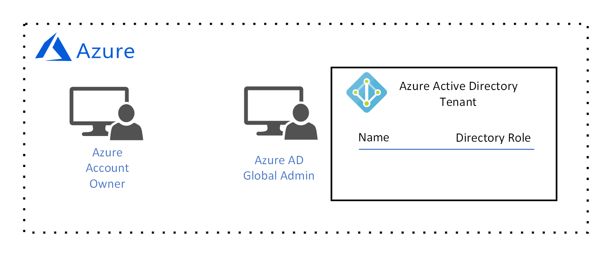

Our requirement for a single privileged account is satisfied by Azure AD. Our next requirement is user accounts for the four specified users, which are created by the Azure AD *global administrator*:

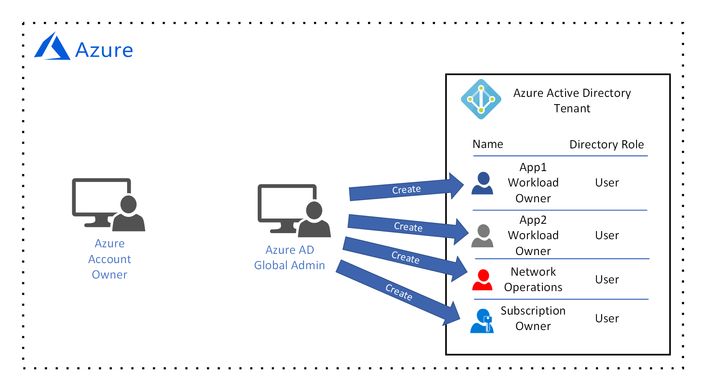

The first two accounts, *App1 Workload Owner* and *App2 Workload Owner* are owned by the two individuals in our organization that are responsible for managing workloads. The *network operations* account is owned by the individual that is responsible for the shared infrastructure resources. Finally, the *subscription owner* account is owned by the individual responsible for ownership of *subscriptions*.

## Resource access permissions model of least privilege

Now that we have our identity management system and user accounts created, we have to decide how we'll apply role-based access control (RBAC) roles to each of them to satify our requirement for a permissions model of least privilege. That is, our requirement is to design a permissions model that grants permission for a user to perform only the action they need to perform, and nothing else. 

Our other requirements are for a single trusted user to delegate rights to *workload owners*. We have a further requirement for the resources associated with each workload be isolated from one another such that no one *workload owner* has management access to the any other *workload* they do not own. We have an slight variation on this requirement in that the *workload owners* must be able to access the shared resources but not management access to them. Finally, we have a requirement to implement this model using only [built-in roles for Azure RBAC][rbac-built-in-roles].

Each RBAC role is applied at one of three *scopes* in Azure: *subscription*, *resource group*, then an individual *resource*. Roles are inherited at lower scopes. For example, if a user is assigned the *owner* role at the *subscription* level, that role is also assigned to that user at the *resource group* and individual *resource* level unless is it overridden.

Therefore, to create a model of least privilege access we have to decide what actions a particular type of user is allowed to take at each of these three scopes. For example, our requirement is for a *workload owner* to have permission to manage access to only the resources associated with their workload and no others. If we were to assign the *owner* role at the *subscription* scope, each *workload owner* would have management access to all workloads.

Let's take a look at two example permission models to understand this concept a little better. In the first example, our model trusts only the *service administrator* to create resource groups. In our second example, our model assigns the *owner* role to each *workload owner* at the *subscription* scope. 

In both examples, we have a *service administrator* that is assigned the *owner* role at the *subscription* scope. Recall that the *owner* role grants all permissions to the *service administrator*.
 

1. In our first example, we have *workload owner A* who wants to manage the resources for their workload. This user doesn't have permission to do anything at the *subscription* scope so they must contact the *service administrator* to request creation of a *resource group* to contain the resources for their workload.
  

2. The *service administrator* reviews their request and creates *resource group A*. At this point, *workload owner A* still doesn't have permission to do anything.

3. In order to enable *workload owner A* to manage resources, the *service administrator* adds them to *resource group A*. The *service administrator* assigns the *contributor* role to *workload owner A*. The *contributor* role grants all permissions on *resource group A* except delegating access permission.
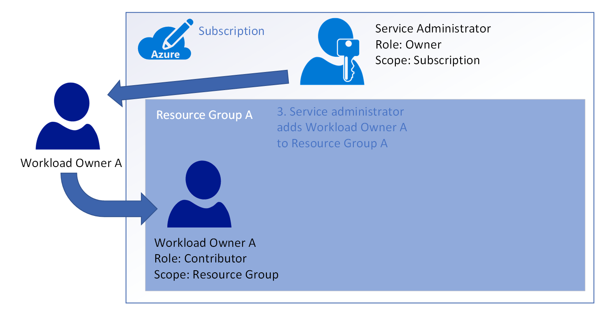

4. *Workload owner A* has a requirement for a pair of team members to view the CPU and network traffic monitoring data as part of capacity planning for the workload. Because *workload owner A* is assigned the *contributor* role, they do not have permission to add a user to *resource group A* directly. They must send this request to the *service administrator*.

5. The *service adminstrator* reviews the request, and adds the two *workload contributor* users to *resource group A*. Neither of these users requires permission to manage resources, so they are assigned the *reader* role. 

6. Now *workload onwer B* also requires a *resource group* to contain the resources for their workload. As with *workload owner A*, *workload owner B* does not have permission to take any action at the *subscription* scope so they must send a request to the *service administrator*. 
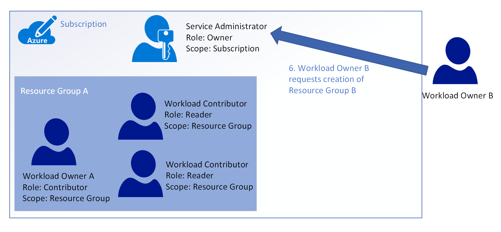

7. The *service administrator* reviews the request and creates *resource group B*.

8. The *service administrator* then adds *workload owner B* to *resource group B* and assigns the *contributor role*. 

At this point we have two workloads, each isolated in their own resource group. None of the users added to *resource group A* has visibility into any of the resources in *resource group B* and vice-versa. This model is a least privelege model because each user is assigned the correct permission at the correct resource management scope.

However, note that every task in this example was performed by the *service administrator*. This is a simple example and it's not an issue because there were only two workload owners, however it's easy to imagine the types of issues that would result if the organization was very large. The *service administrator* can become a bottleneck, resulting in a backlog of requests that create unacceptably long delays for development teams.

1. In our second example, *workload owner A* is assigned the *owner* role at the *subscription* scope. This enables them to create their own *resource group*.

2. Now, *workload owner A* creates *resource group A* and is added by default. Note that *workload owner A* inherits the *owner* role from the *subscription* scope.

3. The *owner* role allows *workload owner A* to delegate management access. *Workload owner A* adds two *workload contributors* and assigns the *reader* role to them. 
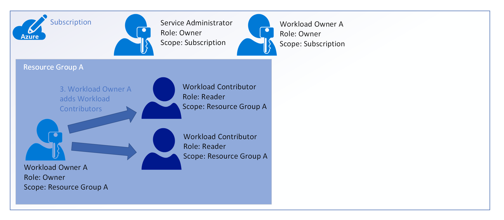

4. Similarly, the *service administrator* now adds *workload owner B* to the *subscription* with the *owner* role. 

5. *Workload owner B* creates *resource group B* and is added by default. Again, *workload owner B* inherits the *owner* role from the *subscription* scope.

Note that in this model, the *service administrator* only had to perform two actions. This means that they are no longer a bottleneck even in a large organization.

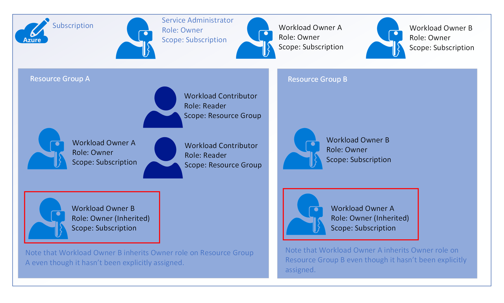

However, because both *workload owner A* and *workload owner B* are assigned the *owner* role at the *subscription scope*, they have also both inherited the *owner* role for each other's resource group. This means that not only do they have full access to one another's resources, they are also able to delegate access to others. For example, *workload owner B* has rights to add any other user to *resource group A* and can assign any role, including *owner*.

If we compare each example to our requirements, we see that both examples supports a single trusted user to delegate rights to *workload owners*. However, only the first example supports the requirement that the resources associated with each workload be isolated from one another such that no one *workload owner* has management access to the any other *workload* they do not own. It follows that our additional requirement that *workload owners* are able to access the shared resources but not have management access to them is also supported only by the first example.

## Resource management model

Now that we've designed a permissions model of least privelege, let's move on to take a look at some practical applications of these governance models. Recall from our requirements that we must support the following three environments:
1. **Shared infrastructure:** a single group of resources shared by all workloads. These are resources such as network gateways, firewalls, and security services.  
2. **Development:** multiple groups of resources representing multiple non-production ready workloads. These resources are used for proof-of-concept, testing, and other developer activities. These resources may have a more relaxed goverance model because to allow for increased developer agility.
3. **Production:** multiple groups of resources representing multiple production workloads. These resources are used to host the private and public facing application artifacts. These resources typically have the tightest goverance and security models to protect the resources, application code, and data from unauthorized access.

For each of these three environments, we have a requirement to track cost data by *workload owner*, *environment*, or both. That is, we want to know the ongoing cost of our *shared infrastructure*, the costs incurred by individuals rin both the *development* and *production* environments, and finally the overall cost of *development* and *production*. 

You have already learned that resources are scoped to two levels: *subscription* and *resource group*. Therefore, our first decision is how to organize our environments by *subscription*. There are two models: a single subscription, or, multiple subscriptions. 

Before we look at examples of each of these models, let's take a look at how access to *subscriptions* is managed. Recall from our requirements that we have an individual in our organization that is responsible for *subscriptions*, and this user owns the *subscription owner* account in our Azure AD tenant. However, this account does not have permission to create *subscriptions*. Only the *Azure Account Owner* has permission to do this:
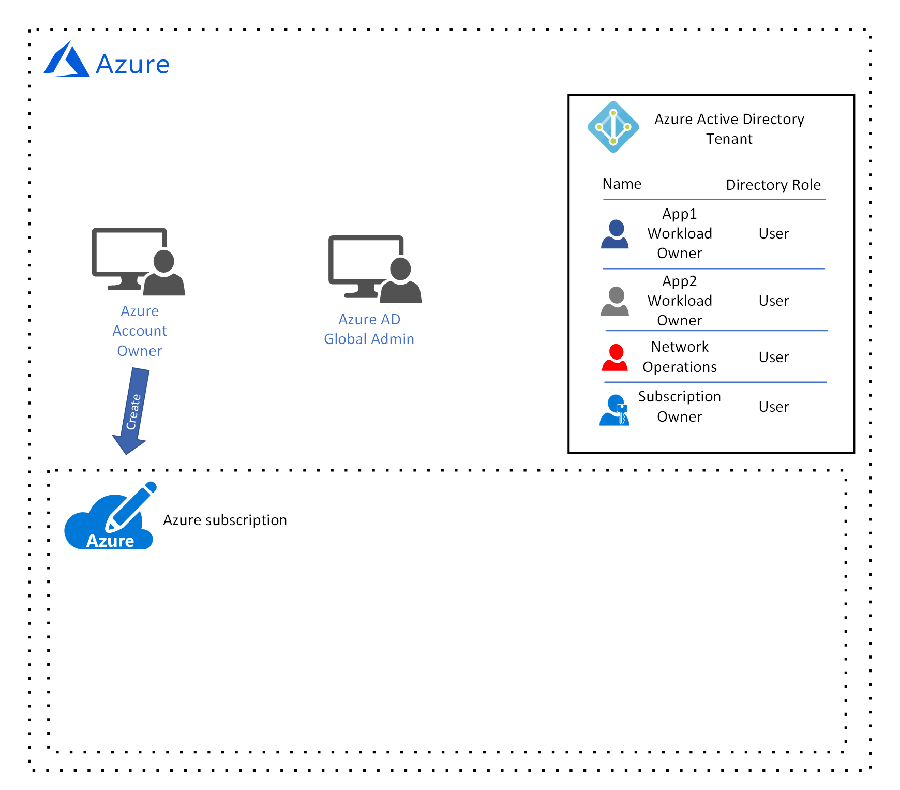

Once the *subscription* has been created, the *Azure Account Owner* can add the *subscription owner* account to the *subscription* with the *owner* role:

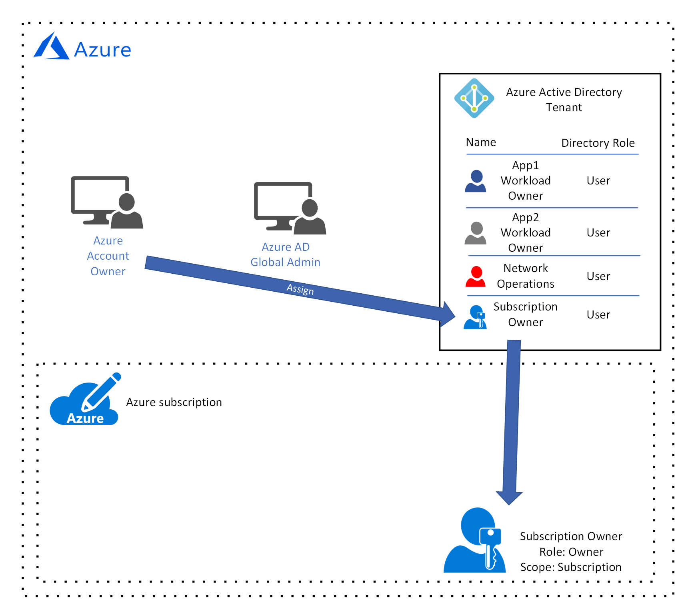

The *subscription owner* can now create *resource groups* and delegate resource access management.

First let's look at an example resource management model using a single *subscription*. Our first decision is how to align resource groups to the three environments. We have two options:
1. Align each environment to a single resource group. All shared infrastructure resources are deployed to a single *shared infrastructure* resource group. All resources associated development workloads are deployed to a single *development* resource group. All resources associated with production workloads are deployed into a single *production* resource group for the **production** environment. 
2. Align workloads with a separate resource group, using a naming convention and tags to align resource groups with each of the three environments.  

Let's begin by evaluting the first option. We'll be using the permissions model that we discussed in the previous section, with a single subscription service administrator that creates resource groups and adds users to them with either the built-in *contributor* or *reader* role. 

1. The first resource group deployed represents the *shared infrastructure* environment. The *subscription owner* creates a resource group for the shared infrastructure resources named *netops-shared-rg*. 
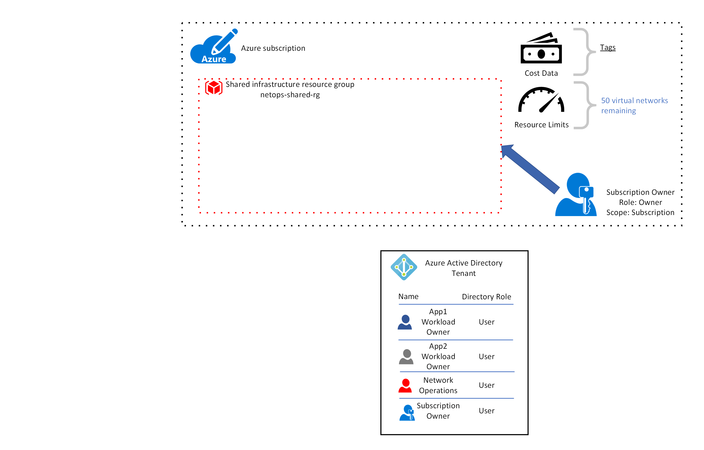
2. The *subscription owner* adds the *network operations user* account to the resource group and assigns the *contributor* role. 
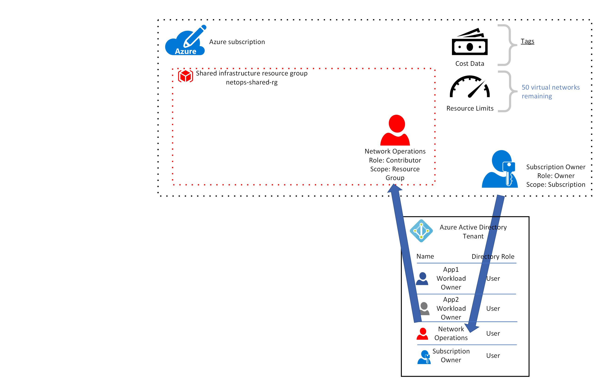
3. The *network operations user* creates a [VPN gateway](/azure/vpn-gateway/vpn-gateway-about-vpngateways) and configures it to connect to the on-premises VPN appliance. The *network operations* user also applies a pair of [tags](/azure/azure-resource-manager/resource-group-using-tags) to each of the resources: *environment:shared* and *managedBy:netOps*. When the *subscription service administrator* exports a cost report, costs will be aligned with each of these tags. This allows the *subscription service administrator* to pivot costs using the *environment* tag and the *managedBy* tag. Notice the *resource limits* counter at the top right-hand side of the figure. Each Azure subscription has [service limits](/azure/azure-subscription-service-limits), and to help you understand the affect of these limits we'll follow the virtual network limit for each subscription. There is a default limit of 50 virtual networks per subscription, and after the first virtual network is deployed there are now 49 available.
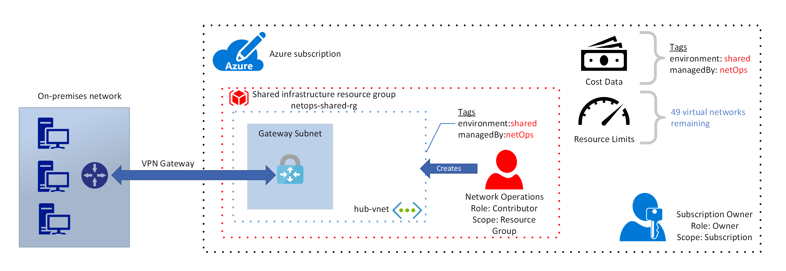
4. Two more resource groups are deployed, the first is named *prod-rg*. This resource group is aligned with the **production** environment. The second is named *dev-rg* and is aligned with the **development** environment. All resources associated with production workloads are deployed to the **production** environment and all resources associated with development workloads are deployed to the **development** environment. In this example we'll only deploy two workloads to each of these two environments so we won't encounter any Azure subscription service limits. However, it's important to consider that each resource group has a limit of 800 resources per resource group. Therefore, if we keep adding workloads to each resource group it is possible that this limit can be reached. 
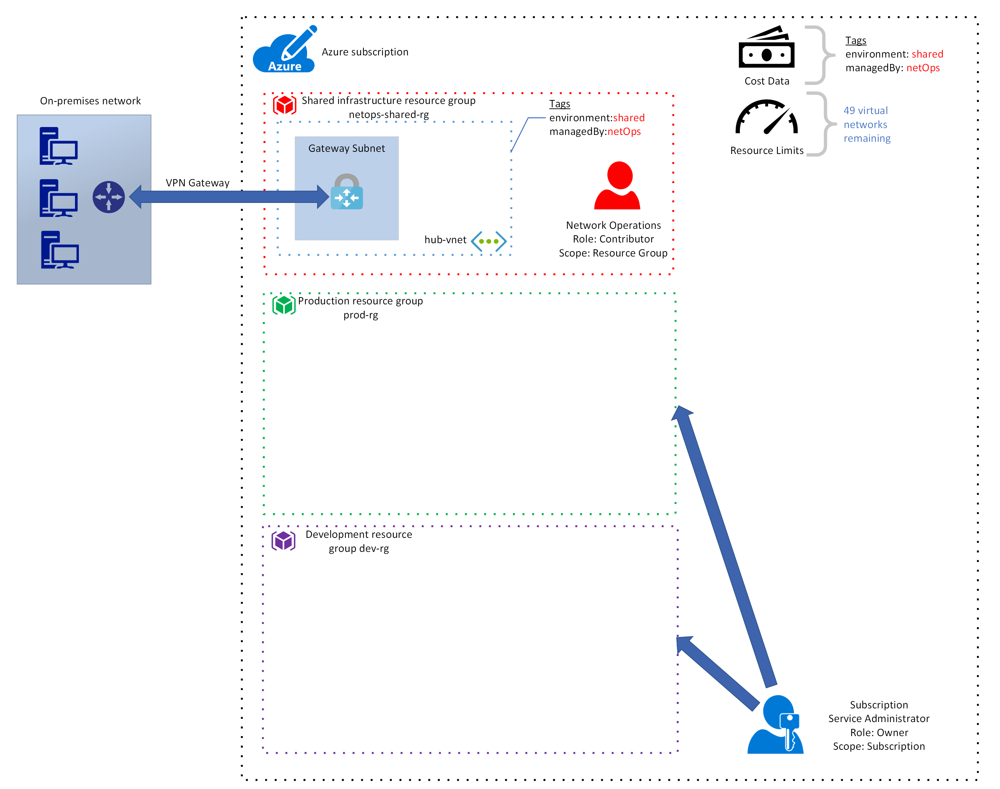
5. The first *workload owner* sends a request to the *subscription service administrator* and is added to each of the **development** and **production** environment resource groups with the *contributor* role. As you learned earlier, the *contributor* role allows the user to perform any operation other than assigning a role to another user. The first *workload owner* can now create the resources associated with their workload.

6. The first *workload owner* creates a virtual network in each of the two resource groups with a pair of virtual machines in each. The first *workload owner* applies the *environment* and *managedBy* tags to all resources. Note that the Azure service limit counter is now at 47 virtual networks remaining.

7. Each of the virtual networks does not have connectivity to on-premises when they are created. In this type of architecture, each virtual network must be peered to the *hub-vnet* in the **shared infrastructure** environment. Virtual network peering creates a connection between two separate virtual networks and allows network traffic to travel between them. Note that virtual network peering is not inherently transitive. A peering must be specified in each of the two virtual networks that are connected, and if only one of the virtual networks specifies a peering the connection is incomplete. To illustrate the effect of this, the first *workload owner* specifies a peering between *prod-vnet* and *hub-vnet*. The first peering is created, but no traffic flows because the complementary peering from *hub-vnet* to *prod-vnet* has not yet been specified. The first *workload owner* contacts the *network operations* user and requests this complementary peering connection.
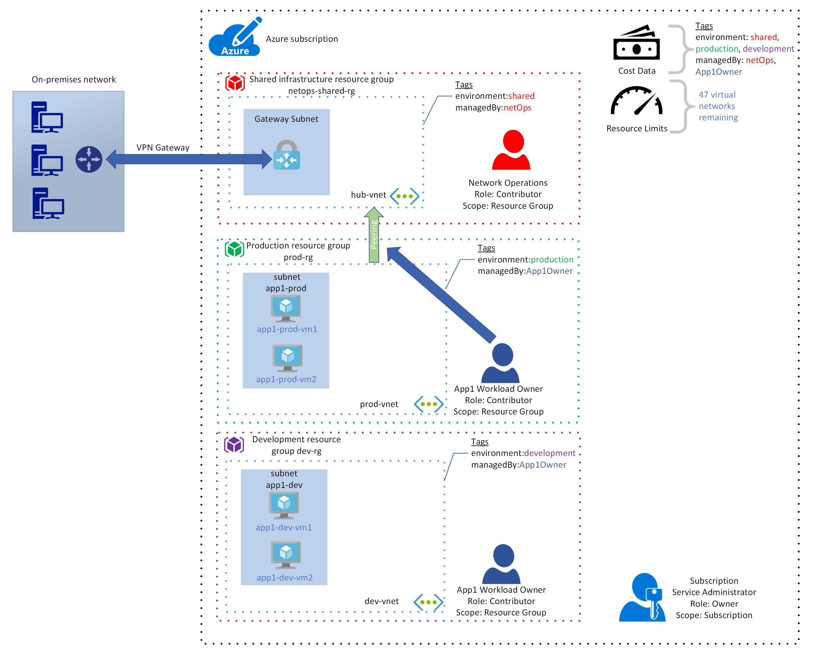
8. The *network operations* user reviews the request, approves it, then specifies the peering in teh settings for the *hub-vnet*. The peering connection is now complete and network traffic flows between the two virtual networks.
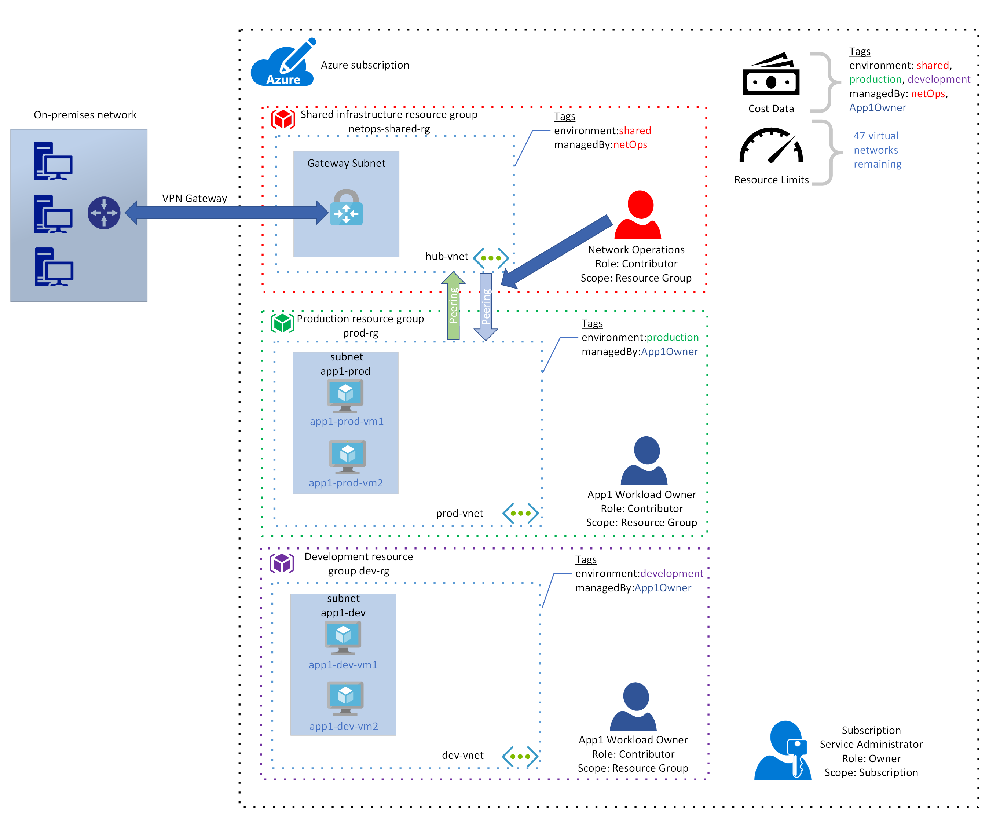
9. Now, a second *workload owner* sends a request to the *subscription service administrator* and is added to the existing **production** and **development** environment resource groups with the *contributor* role. The second *workload owner* has the same permissions on all resources as the first *workload owner* in each resource group. 
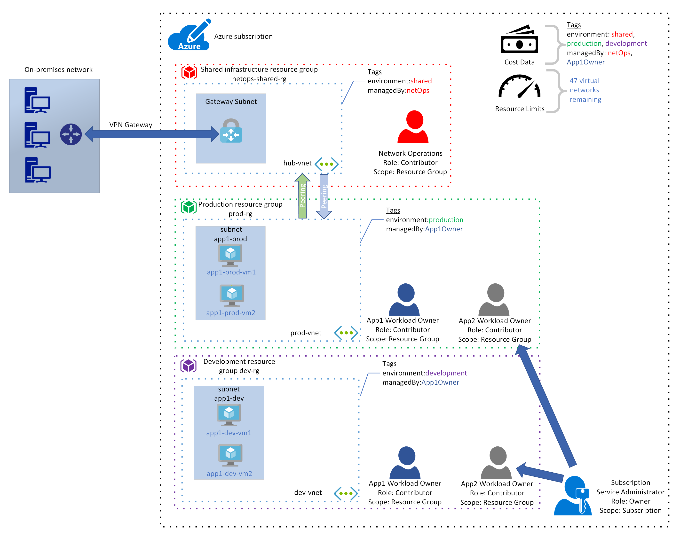
10. The second *workload owner* creates a subnet in the *prod-vnet* virtual network, then adds two virtual machines. The second *workload owner* applies the *environment* and *managedBy* tags to each resource.
 

This example resource management model enables us to manage our resources in the three required environments. Our shared infrastructure resources are protected because there's only a single user in the subscription with permission to access those resources. Each of our workload owners are able to utilize the share infrastrucutre resources without having any permissions on the actual shared resouces themselves. This management model fails our requirement for workload isolation - each of the two *workload owners* are able to access the resources of the other's workload. 

There's another important consideration with this model that may not be immediately obvious. In our example, it was *app1 workload owner* that requested the network peering connection with the *hub-vnet* to provide connectivity to on-premises. The *network operations* user evaluated that request based on the resources deployed with that workload. When the *subscription owner* added the *app2 workload owner* with the *contributor* role, that user had management access rights to all resources in the *prod-rg* resource group. 

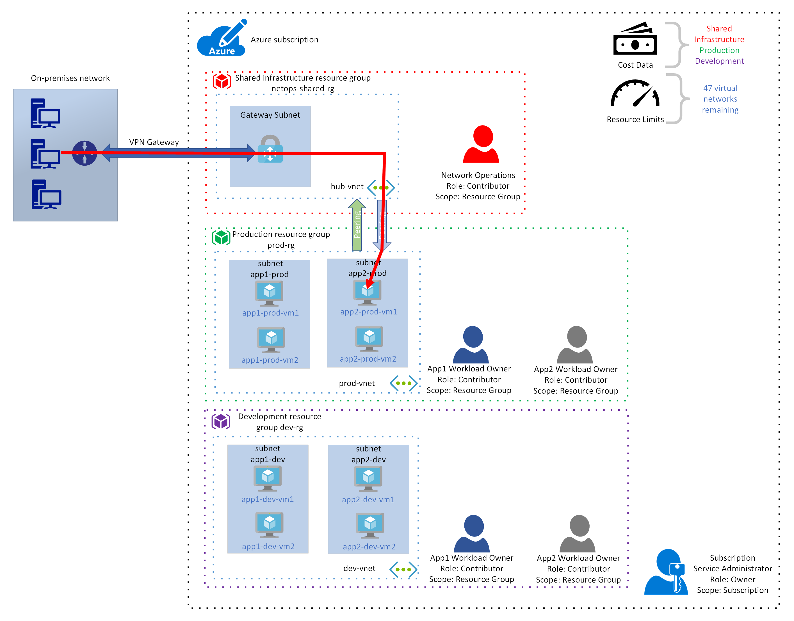

This means *App2 workload owner* had permission to deploy their own subnet with virtual machines in the *prod-vnet* virtual network. By default, those virtual machines now have access to the on-premises network. The *network operations* user is not aware of those machines and did not approve their connectivity to on-premises.

Next, let's look at a single *subscription* with multiple resources groups for different environments and workloads. Note that in the previous example, the resources for each environment were easily identifiable because they were in the same resource group. Now that we no longer have that grouping, we will have to rely on a resource group naming convention to provide that functionality. 

1. Our *shared infrastructure* resources will still have a separate resource group in this model, so that remains the same. Each workload requires two resources groups - one for each of the *development* and *production* environments. For the first workload, the *subscription owner* creates two resource groups. The first is named *app1-prod-rg* and the second one is named *app1-dev-rg*. As discussed earlier, this naming convention identifies the resources as being associated with the first workload, *app1*, and either the *dev* or *prod* environment. Again, the *subscription* owner adds the *app1 workload owner* to the resource group with the *contributor* role.
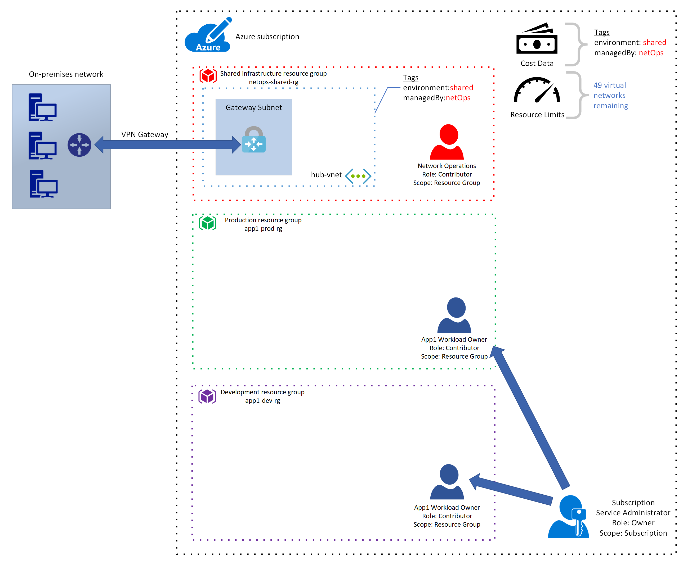
2. Similar to the first example, the *app1 workoad owner* deploys a virtual network named *app1-prod-vnet* to the *production* environment, and another named *app1-dev-vnet* to the *development* environment. Again, the *app1 workload owner* sends a request to the *network operations* user to create a peering connection. Note that the *app1 workload owner* adds the same tags as in the first example, and the limit counter has been decremented to 47 virtual networks remaining in the *subscription*.
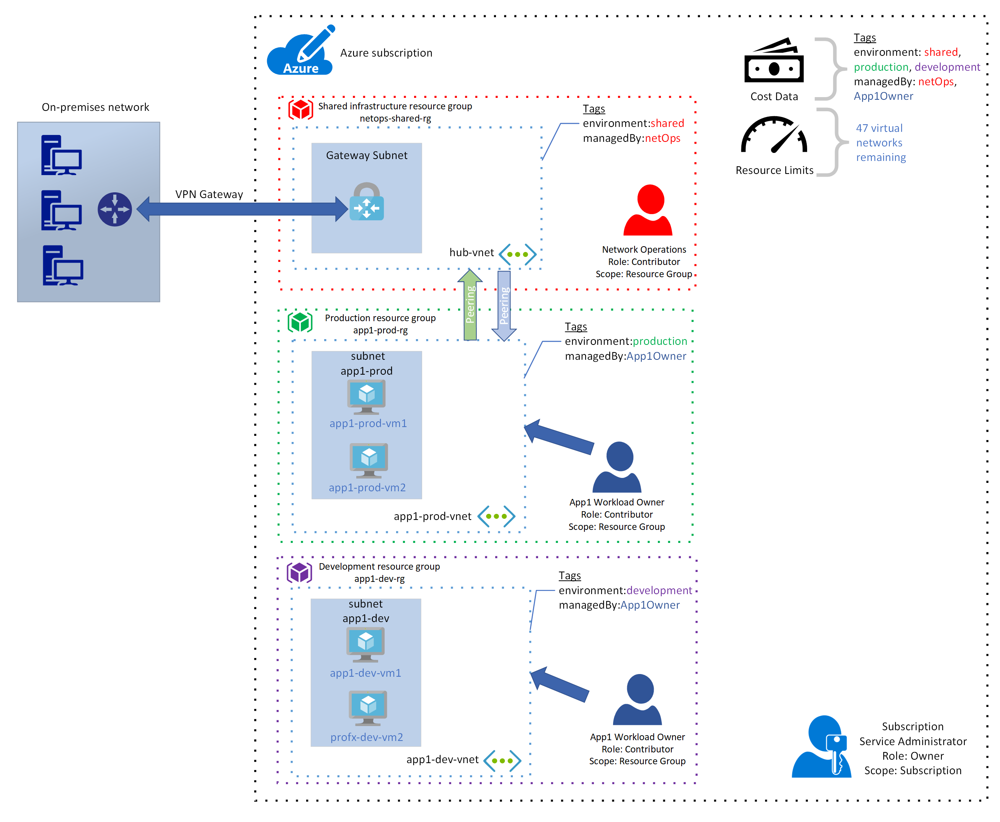
3. The *subscription owner* now creates two resource groups for the *app2 workload owner*. Following the same conventions as for *app1 workload owner*, the resource groups are named *app2-prod-rg* and *app2-dev-rg*. The *subscription owner* adds *app2 workload owner* to each of the resource groups with the *contributor* role.
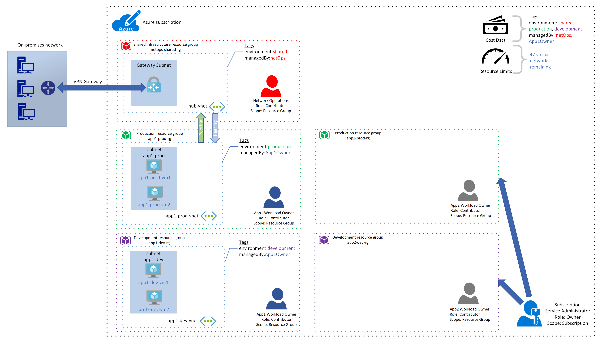
4. *App2 workload owner* deploys virtual networks and virtual machines to the resource groups with the same naming conventions. Tags are added and the limit counter has been decremented to 45 virtual networks remaining in the *subscription*.
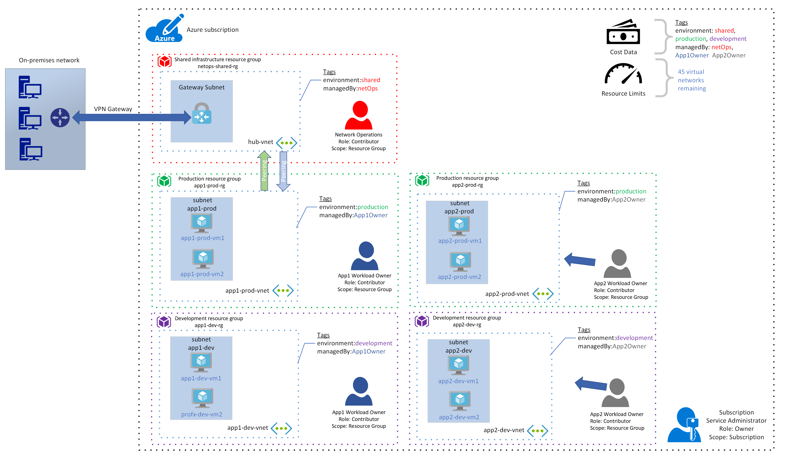
5. *App2 workload owner* sends a request to the *network operations* user to peer the *app2-prod-vnet* with the *hub-vnet*. The *network operations* user creates the peering connection.
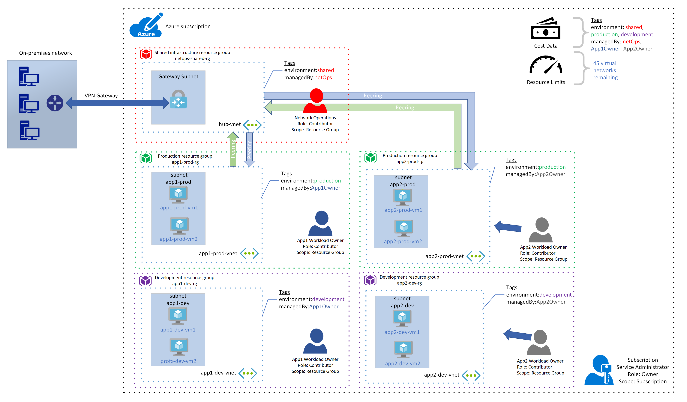

The resulting management model is similar to the first example, with several key differences:
* Each of the two workloads are isolated by workload and by environment.
* This model required two more virtual networks than the first example model. While this is not an important distinction with only two workloads, the theoretical limit on the number of workloads for this model is 24. 
* Resources are no longer grouped in a single resource group for each environment. Grouping resources requires an understanding of the naming conventions used for each environment. 
* Each of the peered virtual network connections was reviewed and approved by the *network operations* user.

Now let's look at a resource management model using multiple subscriptions. In this model, we'll align each of the our three environments to a separate subscription: a **shared services** subscription, **production** subscription, and finally a **development** subscription. The considerations for this model are similar to a model using a single subscription in that we have to decide how to align resource groups to workloads. We've already determined that creating a resource group for each workload satisfies our workload isolation requirement, so we'll stick with that model in this example.

1. In this model, there are three *subscriptions*: *shared infrastructure*, *production*, and *development*. Each of these three subscriptions requires a *subscription owner*, and in our simple example we'll use the same user account for all three. The *shared infrastructure* resources are managed similarly to the first two examples above, and the first workload is associated with the *app1-rg* in the *production* environment and the same-named resource group in the *development* environment. The *app1 workload owner* is added to each of the resource group with the *contributor* role. 
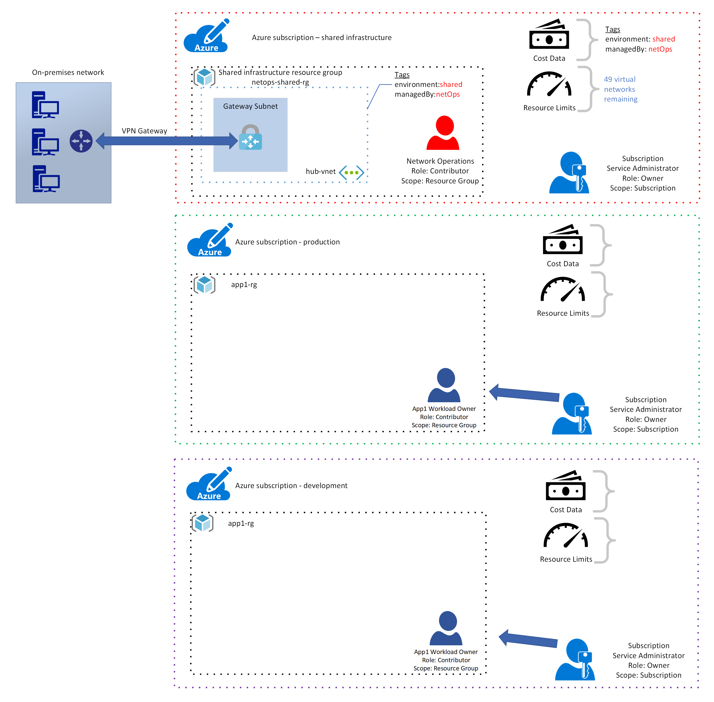
2. As with the earlier examples, *app1 workload owner* creates the resources and requests the peering connection with the *shared infrastructure* virtual network. *App1 workload owner* adds only the *managedBy* tag because there is no longer a need for the *environment* tag. That is, resources are for each environment are now grouped in the same *subscription* and the *environment* tag is redundant. The limit counter is decremented to 49 virtual networks remaining.
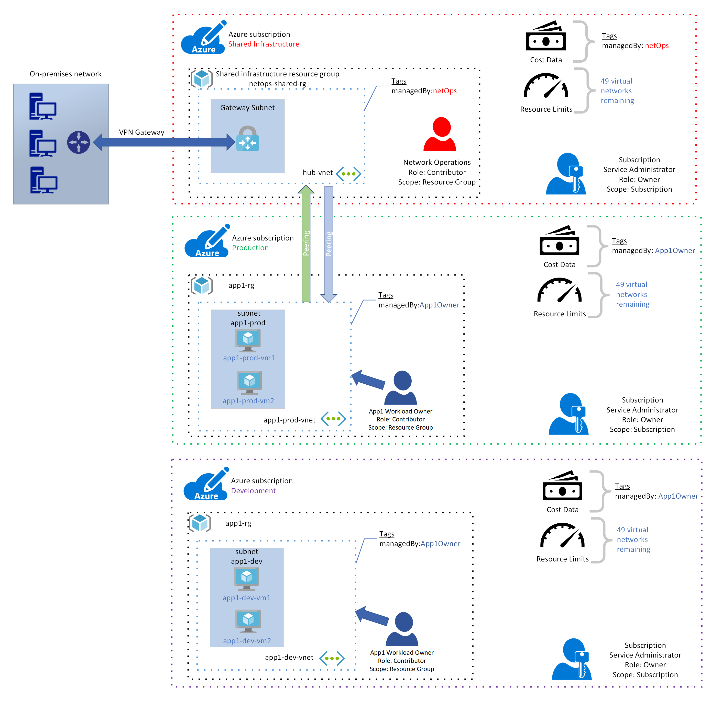
3. Finally, the *subscription owner* repeats the process for the second workload, adding the resource groups with the *app2 workload owner* in the *contributor role. The limit counter for each of the environment subscriptions is decremented to 48 virtual networks remaining. 

This management model has the benefits of the second example above. However, the key difference is that limits are less of an issue due to the fact that they are spread over two *subscriptions*. The drawback is that the cost data tracked by tags must be aggregated across all three *subscriptions*. 

Therefore, you can select any of these two examples resource management models depending on the priority of your requirements. If you anticipate that your organization will not reach the service limits for a single subscription, you can use single *subscription* with multiple resoure group model. Conversely, if your organization anticipates many workloads, the multiple *subscription* model may be better.

## Next steps

<!-- links -->

[rbac-built-in-roles]: /azure/role-based-access-control/built-in-roles
